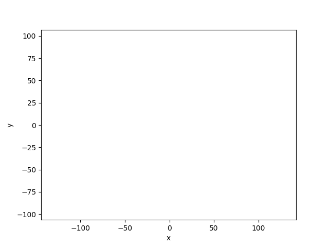

# Computational Geometry
## Computer Science | AGH 2025/2026

## Project Description

This repository provides implementations of various algorithms from the Computational Geometry university course.

Laboratory resources are provided by the [_BIT Scientific Group_](https://github.com/aghbit/Algorytmy-Geometryczne).

## Table of Contents

| Laboratory      | Description                                      | Source |
|-----------------|--------------------------------------------------|--------|
| **Lab 1**       | Geometric Predicates                             | [Lab1](labs/lab1) |
| **Lab 2**       | Convex Hull - Graham and Jarvis Algorithms       | [Lab2](labs/lab2) |
| **Lab 3**       | Monotonic Polygon Triangulation                  | [Lab3](labs/lab3) |
| **Lab 4**       | Line Intersection - Sweep Line Algorithm         | [Lab4](labs/lab4) |
| **Project**     | Processing and storage of the description of a triangular mesh on the plane | [Project Repository](https://github.com/adrianmikoda/2D-triangulation-mesh-project) |

## License
This project is licensed under the MIT License. See the [LICENSE](LICENSE) file for details.
